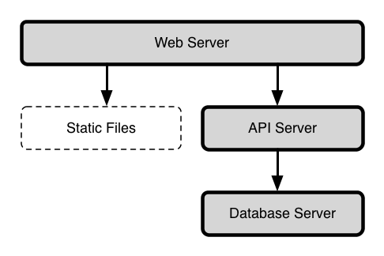
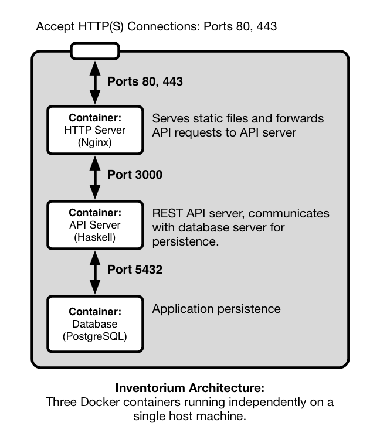
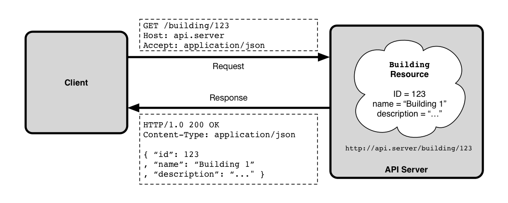
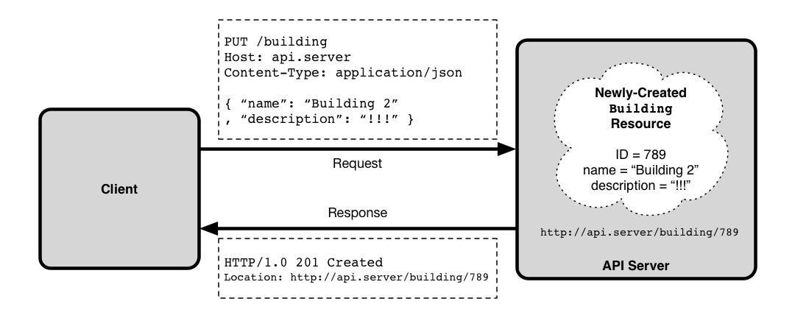
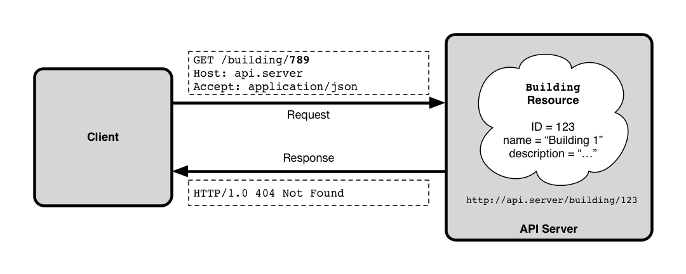
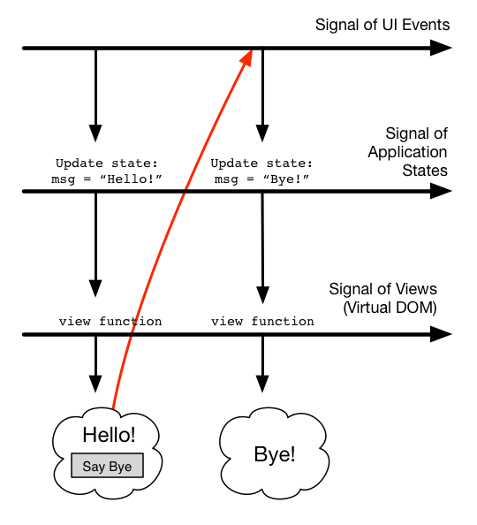

# Inventorium: A RESTful Inventory Management API in Haskell

# Description and Motivation

During the Spring 2015 semester, Dr. Hayes introduced our software engineering class
to two instructional technology managers from the  Powell County school system.
In an experiment in software team management, the class organized into subgroups to design
and implement a single software package for tracking the significant inventory of
desktop computers, laptops, tablets, and other pieces of technology that these users
were tasked with managing.

For various reasons, the project was unsuccessful. However, being from Eastern Kentucky myself,
I was interested in completing the project and seeing something really useful delivered
to the end users in Powell County.

During our software engineering course, my subgroup was primarily responsible for the design of
the application and, later, the management of the rest of the development subteams. Our design
was a typical three-tiered architecture:

- a browser-based client,
- a web API,
- a relational database.



We made specific technical decisions based on the realities of the large team. Our primary
criterion was finding technologies with which our team members had prior experience. 
Secondarily, we needed technologies that were accessible in both paradigm, documentation,
and availability of learning resources.

With these criteria in mind, we chose to implement the web API in PHP, a widely-available dynamic
programming language well-suited for web development. We knew a basic RDBMS would be 
the best choice for the database layer and chose MySQL for its ease of setup. Finally,
we chose a combination of Twitter Bootstrap and Backbone.js to implement the browser-based
client. Twitter Bootstrap is a CSS styling library, which let the front-end team focus
on the user interface organization despite relatively shallow web design skills.
Among the many JavaScript frameworks, Backbone.js was chosen because it was the one the front-end
felt most comfortable with.

Perhaps the most successful technical choice in the initial design was the use of two software
systems, Vagrant and Ansible, to provide consistent, reproducible virtual development environments
for the team. Vagrant offers a way to create, manage, and boot virtual machine images while Ansible
is used to describe and execute provisioning strategies for remote systems, virtual or otherwise.
Prior to all the subteams beginning their work, our team set up a virtual environment that could
be reproduced consistently by individual team members with just a few commands.

These technologies were, for the most part, ones that I was very comfortable with. In my
day-to-day work doing web application development, the so-called LAMP stack (Linux, the
Apache web server, MySQL, and PHP) is very common. This experience was useful, since I would be able
to answer any questions that came up in the process.

However, that same work experience has taught me that many aspects of this technology stack
are woefully inadequate. For this reason, I chose to explore re-implementing this basic
architecture while making technology choices based on technical factors rather than the
expediencies required by a time-constrained, large-group project.

# Architecture

The approach of using virtual machines for development was really the most successful
part of the original project. With surprisingly few issues, around 20 students were able to
start contributing code to the project despite different operating system configurations and
and experience with the technology stack.

However, the environment we used has a potentially serious drawback. It consisted of a single
VM that contained both the database server and the web server, responsible for serving both
the web API and static files (HTML, JavaScript, CSS, and images) for the client.
In a production scenario, this would clearly be problematic for scalability.

Ideally, the API server, the static web server, and the database server should all be separate. This
offers more flexibility: as usage increases, multiple API servers could be run behind a load balancing
mechanism or multiple database servers could be provisioned to handle queries, via replication.
Of course, if managing a single-machine architecture benefitted from automation, orchestrating
a multi-tiered architecture practically necessitates it.

I chose to solve this problem using a technology called Docker. Docker is a so-called
"containerization" platform. Essentially, individual services (an API server, a database, etc.)
can be packaged as containers: lightweight, bare-bones VMs that can, but are not required to,
run on the same host machine. Containerized services are completely isolated, eliminating
issues where, for example, an installed dependency for the database server is incompatible with
the API server. The containers can still communicate over the network by explicitly mapping
network ports within the containers.



The three primary components of the Inventorium platform are a web server, an API server, and a
database server, each running in their own containers. The web server is configured to
forward API requests to the API server. Similarly, the API server communicates with the database
server for persistence. Although this was not implemented, there is good
support for deploying containers to cloud platforms like Amazon Web Services. This is an advantage,
because it would allow Powell County Schools to make use of Inventorium cheaply, without needing
to manage a dedicated server, and avoiding potential issues with deploying to a shared server in the
school district's IT office.

The web server container runs the Nginx web server. The original implementation used the Apache
web server for simplicity. Apache uses OS-level threads to handle each web request. This approach
introduces significant overhead for each request. This is less important when requests
require a great CPU or I/O utilization (e.g., when responding to a complex API request), but when
handling many simple requests (e.g., for static files or simply proxying requests to an
API server), Nginx's single-threaded, event loop-based architecture offers higher throughput and
better responsiveness.

I chose to carry on using a RDBMS for the project, rather than opting for a NoSQL solution
such as a document-based database like MongoDB. Ultimately, I chose to use PostgreSQL rather
than MySQL. MySQL is an extremely common choice for small to medium sized web applications, but
although it has made improvements in the past few years in terms of standards compliance, transactional
safety, and data integrity, PostgreSQL is still regarded as better in these areas.

The final choice, and the focus of both my development effort and the technical
discussion here, regards the implementation of the API server. I chose to use Haskell, a strong-
and statically-typed pure functional programming language that compiles to native code. Haskell's
pedigree is decidedly academic and it is often derided as being overly theoretical,
but as I will discuss below, it has a number of features that make it appealing for what
is often called "line of business" software and not just writing compilers or experimenting
with type systems and programming language theory.

# The Web API

Generally, the purpose a web API is to expose the operations of the business domain over HTTP.
We use an architecture called Representational State Transfer (REST) to accomplish this. Described by
Roy T. Fielding in his 2000 PhD dissertation [1], REST is an architectural style that emphasizes
building around the fundamental concepts of the web: HTTP and hypermedia (i.e., navigable links between
entities).

In a RESTful architecture, domain objects (and collections or other aggregates of those objects) are
*entities* (in the HTTP sense), i.e., resources addressed by URLs. They may be available in many
representations: an image resource might be available in a JPEG representation or PNG. HTTP's methods
(verbs like `GET` and `POST`) describe the operations available. A `GET` request is a request for a
representation of a resource, i.e., a read operation.  A `PUT` request takes a representation of an
entity and requests that the application store it, i.e., a create request.






Other aspects of the API are all handled through the well-defined channels of HTTP. Options and
parameters can be specified using URL query string parameters and/or HTTP headers. Similarly,
errors are reported via HTTP status codes. If a user requests an entity that does not exist, 
the result should be the well-known 404 response. If the entity exists but the user requests
an representation the server does not know how to provide, the API should instead respond with
HTTP's "406 Not Acceptable" error code.



REST can be a restrictive architecture, but its principle of offering a uniform interface to APIs
is powerful. For example, HTTP defines `GET` requests to be an  *idempotent* operation, meaning that
a `GET` request should not change the state of an entity on the server. Thus, if an application
properly implements the REST architecture, you get caching of `GET` requests for free via standard
HTTP caching mechanisms.

The inventory management domain fits naturally within the REST scheme. The system tracks facility
information (buildings and the rooms within them), inventory items and their properties (e.g., a laptop's
CPU, memory, and hard drive specs), and "check-in" records that indicate an inventory
item was logged as being present in a given room at a given date and time.

The API organizes this domain with a system of hierarchical URLs. For example, facility 
information is organized into four entities addressed by different URLs:

a. `/api/buildings` — the collection of building entities
b. `/api/building/:buildingID` — an individual building entity with the given ID
c. `/api/building/:buildingID/rooms` — the collection of rooms in a given building
d. `/api/building/:buildingID/rooms/:roomID` — an individual room entity

URLs (b) and (d) address individual entities. HTTP `GET` requests retrieve a representation
of that single entity, while HTTP `PUT` updates it (with the new details included in the
body of the HTTP request), and HTTP `DELETE` deletes the record (if allowed by business logic
rules).

URLs (a) and (c) address *collections* of entities. HTTP `GET` retrieves a representation
of the entire collection and `POST` creates a new entity within the collection (with the details
of the new entity in the request body), while HTTP `PUT` and `DELETE` are not supported.

# Implementation

## A Short Introduction to Haskell

Before we discuss the specific details of the web API's implementation, I will present 
a short example that illustrates a few of Haskell's features. The following code sample
uses parametric polymorphism to implement a homogeneous linked list and a
function over that data type.

```haskell
data List a = Cons a (List a)
            | Nil
            deriving (Eq)

length Nil              = 0
length (Cons head tail) = 1 + length tail
```


We define a data type `List` that takes a single type parameter `a`.  This is a homogeneous
list, and every element will be of that type `a`. `List` is a recursive, algebraic data type,
since it is the *sum* of two cases: a `List` is either a `Cons` cell (to use the Lisp terminology)
that contains a value of type `a` plus a pointer to another `List`; or it is `Nil`, the empty list.
Note that `Cons` is itself a *product* of two types, `a`, the type of items in the list
and, recursively, `List a`.

The `deriving` keyword instructs the Haskell compiler to generate an
implementation for the `Eq` typeclass. Typeclasses are analogous to Java interfaces and
a datatype must implement `Eq`'s interface to be comparable via the `==` operator.
With this automatic derivation, lists containing any data type (that itself implements `Eq`)
can be compared for equality.

Finally we define a function `length` on `List`. We use a feature called *pattern matching*
to define the two cases for the function. If `length` is applied to `Nil`, the result
is zero (an empty list has length zero). Otherwise, we have a `Cons` cell with a `head`
element and a `tail` list and the length is one plus the length of `tail`.

This small example demonstrates a number of Haskell language features that have
important practical implications. Algebraic data types are more expressive than simple
enumeration types and they make the pattern matching in our function definition possible.
They also allow the compiler inform us when our pattern matches are not exhaustive, which
often indicates a logic error. Additionally, as we saw with the automatic derivation of the
support for the `Eq` typeclass, they enable the compiler to systematically generate code
for us at compile time.

Parametric data types (known as *generics* in some languages) are also powerful. With
our parametric list type, we can work with `List`s of `String`s, `Integer`s, or any
custom data type and use all the existing `List` code while still enjoy the security 
of knowing that the compiler can tell the difference between a `List` of `Strings` and
a list of `Integers`, unlike languages with out parametric data types like Go or early
versions of Java.

Parametricity in combination with Haskell's default purity can be very powerful 
for reasoning about code. A function of type `a -> a`, i.e., a function
that takes a value of some type `a` and returns a value of that same type,
can only have one implementation in a pure language: the identity function. This
is a very trivial example, but the Haskell ecosystem is filled with libraries
where parametricity and purity allow their maintainers to reason about the correctness
of their code.

Consider our definition of the `length` function. Notice that despite all of the
discussion about the strength language's type system, we did not actually have to add a type
signature. Because Haskell makes use of *type inference*, it is able infer
that `length` has a type of `List a -> Integer` just based on the types of the patterns
and return values used in the definitions. Anyone who has written Java code that
looked like `HashMap<Integer, String> = new HashMap<Integer, String>()` will
appreciate the ability to use an expression and let the compiler infer the type
and make sure it is consistent. While it is standard practice to annotate top-level
functions with a type signature, both for documentation purposes and as an early
sanity check, in most cases they are unnecessary.

Finally, we should take a closer look at what are perhaps Haskell's most radical
features: *laziness* and *purity*. Laziness, or non-strict evaluation, means that
when evaluating an expression, subexpressions are only evaluated as needed. The C
language uses a simple form of lazy evaluation to evaluating short circuit operators like
`&&` and `||`. If the first operand of `&&` is evaluates to false, the second is not
evaluated at all. However, Haskell uses this evaluation strategy everywhere by default.
In practical terms, evaluation is driven by demand. For instance, we could cleanly
define an enormous (or even infinite) data structure like a game tree, and it will only
be evaluated as deeply as its consumer requires.

Implementing lazy evaluation by default in an typical imperative program would be
tricky, if not impossible. To enable this, Haskell functions are pure, meaning
they have no side effects (direct manipulation of memory, I/O, etc.) and
always return the same result given the same parameters. This property is
nice for reasoning about code and it enables the Haskell compiler
to make optimizations that would be impossible in an impure language.

Of course, real software (like web API servers) needs to do things like read
user input or communicate with the network. Haskell exposes these operations in an interesting
way. Values of polymorphic type `IO a` represent instructions for the Haskell
runtime to perform some operation that may have side effects that will yield
a value of type `a`. 

For example, `getChar` is a function of type `IO Char`. Calling `getChar` does
not return a `Char`. Instead, `getChar` is a pure function (as all Haskell functions
are) that returns an instruction that, if executed by the runtime, will
read a character from standard input and yield it to subsequent `IO` actions.
Primitive operations like `getChar` can be sequenced together to
create more complex operations like reading a line of text from an input stream. 

`IO` is an example of a *monad*, a common abstraction in Haskell. A monad
can be thought of as a computational context that supports sequenced operations.
Other examples include sequenced computation with mutable or read-only state,
non-deterministic computations, or computations that may or may not yield a result.
Haskell also supports the notion of *monad transformers*, which compose multiple
monads together into a *monad stack*. In essence, sequencing and custom monad 
stacks allow us to define our own custom imperative sub-languages: I/O with
read-only configuration, non-deterministic computation with short-circuit failure,
or whatever the application requires.

This has been only a very cursory introduction to some of Haskell's interesting
features. The focus of the rest of the document is on how Haskell was used in this
project rather than the language itself. For those interested in a more in-depth
introudction to Haskell, I have made available in the Inventorium project's GitHub repository
a series of lecture notes on the language written for an independent study done
during my course work:

```
https://github.com/zachmay/inventorium/blob/master/haskell-lecture-notes.pdf
```

## Libraries

Two Haskell libraries were pivotal to the implementation of the web API: Servant for
defining and implementing RESTful APIs and Persistent for database access.

### Servant

The core concept of Servant is to express a REST API as a data type. That data type forms
a specification of the API that can be used by the compiler to guarantee that the functions
that implement the API conform to the specification. Additionally, Servant's code for
dispatching HTTP requests uses this specification via for routing those requests to the appropriate
handlers, decoding request details into Haskell values, performing content type negotiation,
validating HTTP headers, encoding resulting values into appropriate content types, and packaging
the response, including using appropriate HTTP response codes.

Servant uses some of the more advanced extensions to the Haskell langauge that have been
implemented in the de facto standard compiler, GHC. Importantly, it uses type-level literals
allowing strings, natural numbers, and lists to be used in type definitions. Type-level
literals are discussed in depth in [2].

Here is a fragment adapted from the project source code:

```haskell
type FacilitiesApi = "api" :> "buildings"
                     :> Header "Authorization" AuthToken
                     :> ReqBody '[JSON] Building 
                     :> Post '[JSON] BuildingDetail
```

This defines a data type that specifies a single API endpoint available at the URL
`/api/buildings`. It specifies that the HTTP header `Authorization` should be captured
for use by the endpoint's handler, interpreted as a value of type `AuthToken`. It requires a
the request body contain JSON that can be decoded into a `Building` value. Our type also specifies
that this endpoint responds to HTTP `POST` requests and will return a JSON encodeding of a
`BuildingDetail` value if successful.

The value of the `Authorization` header and the decoded `Building` value
will be captured and passed to the handler function, again adapted from the project source:

```haskell
postBuilding :: Maybe AuthToken -> Building -> Handler BuildingDetail
postBuilding auth building = do
    checkAuthToken auth
    validateBuilding Nothing building
    buildingId <- runDb $ insert building
    return $ BuildingDetail { building = Entity buildingId building
                            , rooms = Nothing }
```

The endpoint's handler is simply a function. Its first parameter is a value of type
`Maybe AuthToken`. `Maybe` is a sum type that represents a value that may or may not be present.
So, if the request supplied an authorization token `"abc123"`, we would receive the value 
`Just "abc123"`. If none was supplied, we get the value `Nothing`.

The second parameter is the decoded `Building` value we got from the request's body.

The return value is of type `Handler BuildingDetail`. `Handler` is our application's custom monad
stack which supports access to read-only configuration information, exceptions, and general I/O,
primarily for database access. In other words, our API endpoint handlers are pure functions
that have configuration implicitly wired through them, can throw exceptions, and return instructions
for how the Haskell runtime should perform I/O to fulfill the request.

We will cover more specific details about the implementation below, but it is worth reflecting
on how Servant worked in practice. There are many web frameworks available, like Ruby on Rails, Django
for Python, and Laravel for PHP. One important criteria for judging frameworks is their ability
to abstract the common details of the HTTP request/response lifecycle. Servant does this as well as,
and perhaps better than, any framework I have worked with. Consider this workflow:

- The request URL is parsed and mapped to an appropriate handler based on the request method (`GET`, 
  `POST`, etc.)
- HTTP headers are parsed and, where applicable, marshalled into native data types:
    - The request `Content-Type` header is checked to ensure that the body of the request is in
      a format that our application is able to accept
    - The `Accept` header is checked to ensure that the client will accept a response in a format
      our application is able to deliver
- URL path fragments (such as the ID of a building) and query string parameters are parsed and
  marshalled into native data types
- The relevant path fragments, query string parameters, and headers are passed to the handler.
- If successful, the return value of the handler is marshalled into an appropriate encoding 
  based on the request's `Accept` header.

There are two important themes here. The first is that although HTTP is a fundamentally text-based
protocol, in all cases, our application logic should deal
with semantically meaningful domain values rather than simple strings or associative arrays.
The framework should abstract the details of marshalling these raw strings
from the request into our domain data types and from our domain data types into raw strings in the
response.

The second is that the framework should abstract the details of handling as many common HTTP error
cases as possible. If we can declaratively define the content types our application is able
to accept, the framework should use that information to return `415 Unsupported Media Type` without
our application code's direct intervention if the client request's body is given in a content type
we do not support or to return `400 Bad Request` if the request body cannot be parsed into a suitable
value

There will always be error cases that only our application can know about. If a request is made for
a record that is not in the database, we should not expect the framework to know to return `404 Not Found`.
However, we should expect it to return `404 Not Found` if the request URL does not map to any known
handler.

Servant is quite successful in these two regards, and I would argue that the Haskell language
contributes to that succes. It does not surprise me to see a pervasive focus
on using meaningful domain data types in a strongly-typed language like Haskell, but Servant leverages
Haskell's features to good effect, using typeclasses to automate marshalling to and from
domain data types. For example, if you have a data type that implements the `ToJSON` and `FromJSON`
type classes, that data type can be accepted in the body of requests with the
`Content-Type: application/json` header and returned in response to requests with the
`Accept: application/json` header.

Similarly, any language could support a framework that offers a declarative way to define acceptable
content types, required headers, and so on, but Servant's radical approach uses Haskell's type
system to make that declarative specification not just a source of runtime information but a
binding, compile-time contract for handler functions. Servant also
supports using that same type-level declarative specification to drive tools that generate 
API documentation and client code for other languages like JavaScript.

While working with Servant, I did come across a few odd corner cases, mostly involving unexpected response
codes in certain error cases. It is possible Servant understands the HTTP specification better than I do,
but Servant is a relatively immature library and these corner cases may be actual bugs. However,
despite some shortcomings, Servant is a very impressive web development framework.

### Persistent

As we have discussed, Inventorium uses PostgreSQL for our application's persistence layer. To interface
with it, our application issues queries to the database server to retrieve records and execute inserts,
updates, and deletes. These queries are expressed in PostgreSQL's dialect of SQL, or
Structured Query Language. These textual queries are transmitted over the network where they are
parsed and executed by the database server.

In many programming langauges, the available database bindings force the programmer to build up
dynamic queries using standard string operations. For example, we might need to concatenate 
an entity ID along with some SQL fragments to build a query. In PHP:

```php
$query = 'select * from buildings where id = ' . $buildingID;
```

Unfortunately, this is a very dangerous approach. First, we have no guarantee that the SQL we 
generate will be syntactically valid and we will not find out about our mistakes until runtime.
Additionally, we have to worry about correctly escaping the strings we concatenate together.
Consider this example where we search for buildings with a specific `name` value:

```php
$query = 'select * from buildings where name = "' . $searchTerm . '"';
```

In addition to being somewhat difficult to read, there is a more serious issue. Suppose that
`$searchTerm` contained the string `'hello "world"'`. The resulting SQL would be:

```sql
select * from buildings where name = "hello "world""
```

This is not syntactically valid SQL, which will only show up when a user enters a problematic
string into an input field. This is worse than just a bad user experience decision, it can 
be abused by a malicious attacker. Suppose `$searchTerm` contained `'foo"; drop table buildings; --'`.
The resulting SQL statement is:

```sql
select * from buildings where name = "foo"; drop table buildings; --"
```

When executed, this query will drop the `buildings` table from the database. That is unlikely to be an
operation you wanted to grant to all users. This is an example of the classic SQL Injection
vulnerability.

Of course, SQL injection can be prevented. The most lightweight solution is to use proper escaping
when building up dynamic queries, but if this must be done manually, it will be error-prone.

Another option is to use stored procedures rather than building truly dynamic queries within
application code. However, dynamic queries are sometimes the the most elegant way to express
a database operation and keeping stored procedures in the database in sync with version control
can require unwanted overhead in terms of build and deployment processes.

Many languages provide database bindings that help make building dymamic SQL queries safer, but
we are still left with the possibility that the SQL we generate will be invalid, either because
of syntactic issues or simply because we refer to incorrect tables or columns.

We use the Persistent library in this project to help deal with our interactions with SQL.
Persistent is a database-agnostic library that uses metaprogramming to generate a typesafe 
interface for basic database access. However, because Persistent was designed to support both
relational database systems like PostgreSQL and document-based database systems like MongoDB,
it does not directly support important relational features such as performing joins between
tables.

Since we are using a relational database, we would like to be able to make use
of those features. There is another library called Esqueleto which builds on Persistent to offer
those relational database features at the cost of some degree of type safety, but it was not
used significantly in this project. Importantly, as of the time the project was implemented,
Esqueleto could not actually guarantee type safety: it is possible to write queries in Esqueleto
that fail at runtime, even when the underlying Persistent schema corresponds to the schema as
it exists in the database.

Persistent works by using a text-based schema definition to generate Haskell code for interfacing
with those tables. Our project's schema defition is found in `site/src/model`. Here is an excerpt:

```
Room json
    building    BuildingId
    name        Text
    description Text
    created     TCTime default=CURRENT_TIMESTAMP
    updated     TCTime default=CURRENT_TIMESTAMP

    UniqueNameInBuilding name building

    deriving Eq Ord Show
```

Here we define the schema for our `rooms` table. Persistent's metaprogramming will generate
a new data type `RoomId` to represent the primary key for this table, along with a record
data type that has fields for a `BuildingId` (the primary key in the `buildings` table),
two text fields for the room's name and description, and two UTC timestamps for 
the time that the record was created and the last time it was updated.

The `deriving` clause tells Persistent to derive implementations for the `Eq`, `Ord`, and `Show` 
typeclasses for this record type. Additionally, the `json` notation tells Persisten to derive
implementations for the `ToJSON` and `FromJSON` typeclasses for automatic marshalling into
and out of JSON representations.

Finally, the line `UniqueNameInBuilding` defines a unique key constraint on this table: no two rows
should have the same `name` and `building` value. In other words, no two rooms in the same building
should have the same name. `UniqueNameInBuilding` will now be available as data constructor
that takes a `Text` value (the room name) and a `BuildingId` value and returns a value that can be
used to uniquely retrieve a room record in the database. 

We make use of this schema definition in `site/src/Types/Model/Persistent.hs`:

```haskell
share [mkPersist sqlSettings, mkMigrate "migrateAll"]
    $(persistFileWith lowerCaseSettings "src/model")
```

At compile time, the `persistFileWith` function will use GHC's metaprogramming engine, Template Haskell,
to read in our schema definition and generate corresponding Haskell code, with the specific mappings
between generated Haskell identifiers and database tables being governed by the `lowerCaseSettings`
value.

This file also defines a function `runDb` that we will see in upcoming examples:

```haskell
runDb :: SqlPersistT IO a -> Handler a
runDb query = do
    pool <- asks getPool
    liftIO $ runSqlPool query pool
```

Persistent's database access functions result in query values that need to be executed in a
particular context.  In particular, we need access to database connection details. Our `Handler` monad
offers access to those details. Essentially, then,  `runDb` takes a Persistent
query that would yield a value of type `a` and transforms it into an action in our application's
`Handler` monad that will get a database connection from the application's connection pool,
use it to execute the query on the database, and yield a result of type `a`.

Persistent provides typesafe functions for using our the generated Haskell data types to interact
with our schema. For example, `get` retrieves a record by primary key. Its type is:

```haskell
(MonadIO m, backend ~ PersistEntityBackend val, PersistEntity val) =>
    Key val -> SqlPersistT backend m (Maybe val)
``` 

This is a rather intimidating type annotation, but it is at the core of
Persistent's typesafe, backend-agnostic approach. This type annotation describes a parametrically
polymorphic data type with three type variables, `m`, `val`, and `backend`, along with type constraints
that restrict what concrete data types can be used. We will describe
the role of each of these type variables and then see how this type assembles them together.

`m` is the monad stack that the query will be executed in. In particular, the constraint `MonadIO m`
means that it needs to be a monad stack built atop the full `IO` monad. This should not be a 
surprise, since we need to be able to interact outside the Haskell runtime to communicate with the
database server.

`val` represents the data type the query should yield. If we are retrieving a `Building` record,
`val` is unified with the type `Building`. The constraint `PersistEntity val` indicates that `val`
must be a type that implements certain under-the-hood operations that Persistent requires. 
Persistent's metaprogramming generates this implementation automatically, but they could be 
implemented by hand.

Finally, `backend` is the database backend that Persistent will be working with (e.g., PostreSQL,
MongoDB, etc.). The constraint `backend ~ PersistEntityBackend val` indicates that the backend 
must be one for which the `val` data type has a proper implementation of the `PersistEntityBackend`
typeclass. This allows Persistent to guarantee at compile time that the data type we are retrieving
is one that can be properly marshalled from the specific database engine we are using into a native
Haskell data type.

Given these facts about the type variables, we can interpret the rest of the type signature.
`get` takes a value of type `Key val`, which is the data type that represents a primary key
for a value of type `val` in a `backend` database. If we are trying to retrieve a `Building`, we
need to provide a `Key Building` value, which is just a synonym of `BuildingId`.

The result is a monadic action that will yield a `Maybe val`, since the primary key may not
exist in the database. Persistent queries execute in a monad stack that layers 
ready-only access to details about the backend on top of a monad that supports `IO`. As we saw,
we use our `runDb` function to lift that monadic action into an action in our `Handler` monad,
still yielding a `Maybe val`.

Now we can make database queries in our handlers. Here is a function in our `Handler` monad that
attempts to retrieve a `Building` record for a given `BuildingId`. It fails with an HTTP 404 error
if no such record exists:

```haskell
fetchBuildingOr404 :: BuildingId -> Handler Building
fetchBuildingOr404 buildingId = do
    maybeBuilding <- runDb (get buildingId)
    case maybeBuilding of
        Nothing -> fail404 "Building not found."
        Just b  -> return b
```

Using Haskell's monadic `do`-notation, this almost looks like imperative code. We use 
`runDb` to execute our query `get buildingId` and bind the result to the identifier
`maybeBuilding`. Then we pattern match on that value. If the result is `Nothing` because
no value was found, we use `fail404` to short-circuit evaluation and fail, which will result
in a 404 response by our application. If we get `Just b`, we found a building that matched
the primary key, namely the value `b`, and yield that.

## Code Organization and Walkthrough

In all, the project consists of about 1,800 lines of code. The API implementation
itself consists of about 1,500 lines of Haskell code, plus another 100 for the
Persistent schema definition file. The rest comprises various utility shell scripts
along with configuration files for Docker and the Cabal, the Haskell build system.

As we walk through the code, please refer to the project's GitHub repository:

```
https://github.com/zachmay/inventorium
```

### Docker Container Definitions

Recall that we use Docker to host isolated, virtualized environments (i.e., containers)
for each of the primary components of our system. The top level of the repository contains
directories for documentation and other utilitarian aspects of the project, but our primary
concern will be with the `database/`, `webserver/`, and `site/` directories and the file
`docker-compose.yml`.

These three directories contain the details for Docker containers that will run our database, web, and
API servers. Each of these directories contains a file `Dockerfile`
that describes how Docker should provision and set up the container. For example, `database/Dockerfile`
simply says to build a container based on version 9.4 of the official PostgreSQL Docker image.
`webserver/Dockerfile` is more involved, installing the `nginx` web server and performing 
setup tasks such as copying configuration files and exposing standard HTTP ports. `site/Dockerfile`
builds from a standard Haskell image and does some configuration so that the API server
container can be used as both a virtualized development environment and host the final executable.

Finally, `docker-compose.yml` is a configuration file for the `docker-compose` tool, which
is responsible for bringing all three component containers into service simultaneously and ensuring
that they are configured to work with each other, in this case by specifying environment
variables and exposing network ports between containers so that the API server can communicate
with the database. 

### Cabal Configuration

Before we move to the Haskell source code, we need to look at one more configuration file:
`site/inventorium.cabal`, a configuration file for Haskell's Cabal package manager. It
describes the package's license, dependencies, and compiler options. If a Haskell software package
includes a "Cabal file", we can use `cabal` to install all of its dependent libraries
and compile it using the appropriate compiler options.

One particular set of options, `default-extensions` describes all of the language extensions
our package will use. While there is a langauge standard for Haskell [3], its use
as a testbed for programming language theory means that new features are added to the GHC
compiler frequently. To prevent every new release breaking existing code, GHC uses a system
of language extensions that can be enabled or disabled at will, even on a file-by-file basis.
In this way, users who want access to new language features can use them without forcing them
on all users.

However, there is one caveat with GHC's language extensions: they are only supported by the GHC,
which means that a project that uses GHC language extensions will not be portable to other compilers.
However, this is only a minor concern. GHC is the de facto standard, can target a wide array of platforms,
and is the only optimizing Haskell compiler available. Moreover, the general trend in the Haskell community
is to embrace langauge extensions: both Servant and Persistent make use of them extensively.

### Data Types

Haskell's focus on strong, static typing makes the API's data types a good place to start 
exploring the Haskell source code. Our application's domain model entities include the
following:

- `Building`s that can contain a collection of `Room`s.
- `ItemType`s that describe a type of inventory, e.g., PCs, tablets, or laptops.
- Each `ItemType` also has a list of `ItemTypeProperty`s that model the fields
  that a user can enter to describe that item. For example, laptops might have
  a field to enter the hard disk size, amount of RAM, manufacturer, and purchase
  year. Users can create new `ItemType`s and along with the `ItemTypeProperty`s that
  can be used to describe them.
- An `Item` represents an inventory item (like a computer or tablet) that is
  tracked in the system. It has an `ItemType` and is described by a a collection
  of `ItemProperty`s that correspond to the `ItemType`'s `ItemTypeProperty`s.
- The inventory history of an `Item` is tracked by a collection of `CheckIn`s
  that associate an `Item` with a `Room` at a given date and time. The `Item`'s
  current assigned location is the `Room` of the most recent `CheckIn`.

This domain model is described in the file `site/src/model`. This definition file
is used by the Persistent library's compile-time metaprogramming facilities to
generate Haskell code that defines the appropriate data types as we saw earlier.
This model definition is referenced in `site/src/Types/Model/Persistent.hs` when we invoke
Persistent metaprogramming facilities to generate our model's data types. At compile time, the generated
Haskell code is spliced into our own and compiled.

Each of the domain model entities described above is modeled
as a Haskell record type and a distinct primary key type is defined. Even if
all of the primary keys are really just integers in the database, distinguishing between
`BuildingId` and `ItemId` in application code enables us to leverage the compiler's type
safety guarantees: the compiler will not allow us to query for an `Item` using a `BuildingId`.

Perhaps the one drawback is that all of the resulting definitions are spliced into the same
module. For this reason, the modules defined in `site/src/Types/Model/` import this module
and re-export things a more organized way. In addition, each
of these modules defines some related data types and typeclass instances. To illustrate, we 
will walk through `site/src/Types/Model/Building.hs`.

```haskell
instance ToText BuildingId where
    toText k = pack . show . fromSqlKey $ k

instance FromText BuildingId where
    fromText t = toSqlKey <$> (readMaybe . unpack $ t)
```

Here we define the `ToText` and `FromText` instances for `BuildingId`s. These typeclasses are used by
Servant to convert values to and from text for use in, for example, URLs. `Text` is a recent
addition to Haskell. `Text` is a more efficient string data type, compared to `String` which is,
for historical reasons, implemented as a linked list of characters.

The implementation of `ToText` is simply a series of transformations. We convert the `BuildingId`
from an `SqlKey` into an integer, turn that into a `String`, and then convert that into a `Text` object.
This illustrates one flaw in Haskell's libraries: because some use `String` and some `Text`, conversion
between the two is often required.

`FromText` is the corresponding typeclass that takes a `Text` representation of a value
and returns a native value if possible. This implementation is almost the exact reverse of
the `ToText` implementation, but because the typeclass definition takes into
account the possibility that the parse will fail, our implementation must as well. 

```haskell
data BuildingDetail =
    BuildingDetail
        { building :: Entity Building
        , rooms :: Maybe [Entity Room]
        }
```

The `Building` datatype generated by Persistent contains all of the details that are stored
in the corresponding database table, but not related records such as the rooms
associated with each building. To model this aggregate, we define a datatype that groups a building 
record with a list of room records. We use `Maybe` to allow for the possibility that the
collection of rooms might not be populated. 

```haskell
instance ToJSON BuildingDetail where
    toJSON (BuildingDetail { building = b, rooms = rs }) =
            maybeUpdateWithAll (toJSON b) [("rooms", toJSON <$> rs)]
```

This implementation of the `ToJSON` typeclass enables Servant to automatically marshall a
`BuildingDetail` value into a JSON encoding for use in API responses. Essentially,
we convert the building record to JSON using Persistent's automatically generated `ToJSON`
implementation for `Building` and update the resulting record with a field for the building's
rooms if present.

```haskell
data BuildingSortBy = BuildingSortByDateCreated
                    | BuildingSortByDateUpdated
                    | BuildingSortByDescription
                    | BuildingSortByName
                    deriving (Bounded, Enum, Eq, Ord, Show)

instance ToText BuildingSortBy where
    toText BuildingSortByDateCreated = "created"
    toText BuildingSortByDateUpdated = "updated"
    toText BuildingSortByDescription = "description"
    toText BuildingSortByName        = "name"

instance FromText BuildingSortBy where
    fromText "created"     = Just BuildingSortByDateCreated
    fromText "updated"     = Just BuildingSortByDateUpdated
    fromText "description" = Just BuildingSortByDescription
    fromText "name"        = Just BuildingSortByName
    fromText _             = Nothing
```

Here we define a data type that will describe how a list of building results will be sorted.
So, if we receive a request for `/buildings?sort=name`, we have a type-safe value `BuildingSortByName`
to represent that option. We define `ToText` and `FromText` so that `BuildingSortBy` values can be converted
to and from `Text` when Servant parses a request URL.

```haskell
data BuildingExpand = BuildingExpandRooms
                    deriving (Bounded, Enum, Eq, Ord, Show)

instance ToText BuildingExpand where
    toText BuildingExpandRooms = "rooms"

instance FromText BuildingExpand where
    fromText "rooms" = Just BuildingExpandRooms
    fromText _       = Nothing
```

Similarly, we want the users of our API to be able to manually select what related information
is returned by the API. In this case, API clients can specify whether or not to retrieve the rooms
attached to a building, saving an unnecessary database query if the room information is not needed. As with
`BuildingSortBy`, we define how to convert `BuildingExpand` values to and from `Text` so
that Servant can parse them into type-safe values for our application code.

We will see how these types are used when we look at the type-level definition of our application's
API in the following section.

### Type-level API Definitions

For organizational reasons, the project's type-level API definition is spread across three files.
However, these three sets of definitions are combined and exported by the `Types.Api` module defined in 
`site/src/Types/Api.hs`. We will look at a few examples dealing with authentication and managing facility
information.

In `site/src/Types/Api/Authentication.hs`, we define a single endpoint:

```haskell
type AuthenticationApi = 
    "api" :> "auth"
        :> ReqBody '[JSON] AuthRequest 
        :> Post '[JSON] AuthResponse
```

The official GHC documentation on type-level literals [4] goes into more detail, but here `"api"` is
a string literal at the *type* level, not the *value* level. Servant defines a type-level operator `:>`
that joins two types together. The result is a chain of elements that define our type-level API definition as
a series of component types that describe various aspects of this particular API endpoint.

In this case, `"api" :> "auth"` are two URL path fragments. As a result, Servant will route requests to the URL
`/api/auth` to the associated handler. Continuing down the chain of `:>` operators, `ReqBody` declares that we
require requests to this endpoint have a request body, in JSON format, to be decoded into a value of type `AuthRequest`.
Finally, `Post` declares that the endpoint should respond to HTTP `POST` requests and that the response
should be a value of type `AuthResponse` that can be encoded into JSON.

`AuthRequest` and `AuthResponse` are two data types defined in `site/src/Types/Misc.hs`. An 
`AuthRequest` is just a record containing a user name and a password, while an `AuthResponse`
is a record with a status indicator and an authentication token or error message, as appropriate.

While there is only one endpoint definition for authentication, the facility management
definitions have several. The file `site/src/Types/Api/Facilities.hs` exports the type-level
API definitions for managing rooms and buildings. Here is a fragment adapted from that file:

```haskell
{- /api/buildings -}
"api" :> "buildings"
    :> Header "Authorization" AuthToken
    :> QueryParams "sort" (SortField BuildingSortBy)
    :> QueryParams "expand" BuildingExpand
    :> Get '[JSON] [BuildingDetail] :<|>

{- /api/buildings/:buildingId -}
"api" :> "buildings" :> Capture "buildingId" BuildingId
    :> Header "Authorization" AuthToken
    :> QueryParams "expand" BuildingExpand
    :> Get '[JSON] BuildingDetail
```

Here we see another operator defined by Servant: `:<|>`. This operator combines two endpoint 
definitions into a larger data type. Using `:<|>` to chain together several endpoint definitions
will result in a single data type that defines our application's entire API.

These two definitions are similar, but introduce a few new features. `Header` declares that
our endpoint expects a specific HTTP header. In this case, our handlers will expect a value
of type `AuthToken`, parsed from the value of the HTTP `Authorization` header. The handler
will use that `AuthToken` to ensure that the user is authenticated before completing the request.

We also see `QueryParams`, which is one of Servant's options for handling URL query string
parameters, the the key/value pairs after the `?` in a URL. For example, `QueryParams "expand"
BuildingExpand` instructs Servant to look for a query string parameter `expand` in a request URL,
followed by a comma-separated list. This will be parsed into a list of `BuildingExpand` values
and passed to our handler. A similar option, `QueryParam`, is available that will parse a
single optional parameter rather than a list, passing it as a `Maybe` value, since the parameter
may not be specified.

Finally, the second endpoint demonstrates the use of `Capture` to expose a fragment of the URL
to the handler. In RESTful APIs, it is very common to address resources using a hierarchical
path, not unlike a directory structure. In our application, `/api/buildings` represents a
collection of building resources (analogous to a folder containing several files), and 
`/api/buildings/123` is the URL of the building with ID 123 within that collection.
`Capture` instructs Servant to capture that fragment of the URL, parse it into a value of type
`BuildingId`, and to pass that into the handler.

### Handlers

Now we will look at the handler functions that service requests to our API's endpoints.
It is important to note that much of the work of dealing with HTTP requests will be done at this point.
In particular, Servant has already used the type-level API definition to parse headers and query string
parameters and return appropriate HTTP errors if the request did not meet our API's preconditions.
We still need to write the code that takes these values and does something useful with them, but
those functions will be type-checked against the same type-level definition.

Much like our type-level API definitions, the handler definitions are spread across three files
for organizational purposes. The facilities management endpoints are grouped together using
a familiar operator:

```haskell
facilitiesHandlers :: ServerT FacilitiesApi Handler
facilitiesHandlers = getBuildingList
                :<|> postBuildingList
                :<|> getBuilding
                :<|> putBuilding
                :<|> deleteBuilding
                :<|> getRoomList
                :<|> postRoomList
                :<|> getRoom
                :<|> putRoom
                :<|> deleteRoom
```

The individual handlers like `getRoom` are defined later on in the file, but we group these functions
together using `:<|>`. Previously, we used `:<|>` as a type-level operator, but here it is being
used as a value-level operator, not so different from `+` or `*`, except that its operands are 
functions. In particular, given two functions `a` of type `A` and `b` of type `B`, `a :<|> b` will
have a type that corresponds to the type `A :<|> B`. This is part of the machinery for how Servant's
type-level definitions get used to type-check handlers at compile time.

Consider this handler function for retrieving an individual building resource, corresponding to
the type-level definition for the `/api/building/:buildingId` endpoint:

```haskell
getBuilding ::  BuildingId -> Maybe AuthToken -> [BuildingExpand] -> Handler BuildingDetail
getBuilding buildingId auth expand = do
    checkAuthToken auth
    building <- fetchBuildingOr404 buildingId
    rooms <- fetchRooms
    return $ BuildingDetail { building = Entity buildingId building, rooms = rooms }
        where fetchRooms = if BuildingExpandRooms `elem` expand
                           then do
                               rooms <- runDb $ selectList [RoomBuilding ==. buildingId] []
                               return $ Just rooms
                           else return Nothing
```

Referring back to the corresponding type-level definition, we know that Servant will capture
a `BuildingId` from the URL, an optional `AuthToken`, and a list of `BuildingExpand`
options. These captured values correspond to the three parameters of our handler function. Our 
handlers operate in the `Handler` stack, the return type indicates that, rather than returning
a `BuildingDetail` value directly, they yield one to a subsequent computation in that monad.

The `Handler` monad is defined as follows:

```haskell
type Handler = ReaderT Config (EitherT ServantErr IO)
```

`Handler` is a *monad stack*, which uses a chain of *monad transformers* to extend a base monad
with other functionality. Reading from the inside out, `Handler` builds upon the `IO` monad,
which allows computations that perform arbitrary I/O. That is then extended with the `EitherT`
monad transformer, allowing for computations to potentially fail with some error value (in this case,
Servant's `ServantErr` type). The resulting monad is further extendend with the `ReaderT` transformer to
allow read-only access to configuration information (in this case,
a type that contains information about a pool of database connections our handlers can use).


Looking back at the definition of our `getBuilding` handler, we see that it uses Haskell's `do`
notation to sequence monadic computations. Without going into detail, `do` allows us to sequence
monadic computations in much the same way we would statements in an imperative program.

In this case, we call `checkAuthToken` to validate the supplied authentication token:

```haskell
checkAuthToken :: Maybe AuthToken -> Handler ()
checkAuthToken Nothing = do
    consoleLog "Failed auth: nothing supplied" 
    failWith $ ServantErr 401 "Unauthorized" "Invalid authorization token" []
checkAuthToken (Just _) = do
    {- Validation code omitted -}
    return ()
```

This function also operates in the `Handler` monad, but it returns `()`, or "unit",
a meaningless value we do not care about. In this incomplete implementation, we
use pattern matching to determine whether an authentication token was 
supplied at all. If not, our computation fails with a `ServantErr` corresponding
to HTTP `401 Unauthorized`. This error result short-circuits the evaluation of
subsequent computations and the `ServantErr` value can be used by Servant to issue
an appropriate HTTP response.

When an authentication token is present, we simply yield `()` which further computations
can ignore and proceed normally. A full implementation would need to check against a database
to ensure that the supplied authentication token is valid. If not, the computation would
fail with an appropriate `ServantErr`.

Once the user's credentials are checked, we call `fetchBuildingOr404`, another computation in the `Handler`
monad. This function takes a building ID and will query the database for it, either yieldng the
resulting `Building` value or failing with a `ServantErr` corresponding to HTTP `404 Not Found`.

Upon successfully retrieving a `Building` record, we attempt to fetch the rooms associated with the
building if requested via the `expand` query string parameter. We use a `where` clause to define that
operation without cluttering the main flow of the function.

Finally, we create a `BuildingDetail` record that contains our `Building` (using Persistent's
`Entity` type which links a record with its database ID) along with the associated rooms if
requested. The handler yields that value as the result of our its computation. At this point, the
handler is finished. Servant uses the type-level API definition to marshall the resulting value into
whatever encoding was requested and builds up the HTTP response to return to the client.

### Wiring Things Together

With all these details in place, wiring our application together is relatively simple. The API
server executable starts up when the API server container is brought online. Its entry point is the
`main` function in `src/site/Main.hs`.

```haskell
main :: IO ()
main = do
    port <- lookupSetting "PORT" 3000
    putStrLn "Starting Inventorium API server..."
    pool <- makePool
    let config = Config { getPool = pool }
    runSqlPool doMigrations pool
    putStrLn $ "Listening on port " ++ show port
    run port $ logStdout $ app config
```

In Haskell, the `main` function always has type `IO ()`: intuitively, `main` is a pure function that returns a lazy computation
that will ultimately result in the value `()`, the "unit" value we have seen before. Our program actually gets executed
when the Haskell run-time forces the full evaluation of that lazy computation.

First, we need to know what port to listen to for API requests. In our application's architecture, API requests are forwarded
from the HTTP server to the API server on a port defined in `docker-compose.yml`. This port number is assigned to an
environment variable in the API server container by `docker-compose`. We use `lookupSetting` to retrieve this value:

```haskell
lookupSetting :: (Read a) => String -> a -> IO a
lookupSetting env def = do
    p <- lookupEnv env
    return $ case p of Nothing -> def
                       Just a  -> read a
```

This `IO` action takes an environment variable name and a default value of type `a`. The type `a` must implement the `Read`
typeclass so that we can parse the value of that environment variable retrieve into a native Haskell type `a`. We use `lookupEnv` 
to look up the value of the variable `env` in the current environment, yielding a `Maybe String`. If the environment variable
was not defined, we get `Nothing` and yield the default value. If we find a value, we parse that string into a native value
using the `read` function provided by the `Read` typeclass and yield the that.

Now we need to configure our database connection pool. Rather than repeatedly opening and closing database connections, we
instead create a pool of them that are kept open throughout the lifetime of the server process. When a handler needs to
communicate with the database, it requests a free connection, releasing it back to the pool when finished.
The `makePool` function initializes a pool of database connections; it ishard-coded to allocate four connections, but
this value could be configured via an environment variable.

```haskell
makePool :: IO ConnectionPool
makePool = do
    dbUser <- lookupEnvironment "DBUSER" "postgres"
    dbName <- lookupEnvironment "DBNAME" "postgres"
    dbPass <- lookupEnvironment "DBPASS" "postgres"
    dbHost <- lookupEnvironment "DBHOST" "database"
    dbPort <- lookupEnvironment "DBPORT" "5432"
    let connectionString = pack $ intercalate " " $ zipWith (++)
            ["host=", "dbname=", "user=", "password=", "port="] 
            [dbHost, dbName, dbUser, dbPass, dbPort] in
                runStdoutLoggingT $ createPostgresqlPool connectionString 4
```

With our connection pool created, we create a `Config` value, a record type that stores a reference to the connection pool.
If future requirements demanded that other pieces of read-only configuration data be exposed throughout the application,
they could be included in `Config`.

We also pass the `Config` value to `doMigrations`, which will use the connection pool
automatically update the PostgreSQL schema on the database server based on the Persistent schema defined when
we compiled the executable. This helps to ensure that the schemas being used by the database and the API server are
in sync.

Finally, We initialize the application's Servant API by passing in the configuration details and use `logStdout` to
direct any application logging to standard output. The result is passed into the `run` function to start up the
application server.  This function is provided by the Warp library, which offers a high performance, event-driven
implementation of low-level HTTP functionality: it listens for network connections and performs basic preprocessing of HTTP
requests before delegating to our application code to generate the responses.

## Testing

Due to time constraints, an exhaustive automated test suite was not implemented. Manual testing
was performed on implemented endpoints based on a known initial database state. This could have 
been implemented as a series of automated integration tests, but there was not enough time to
complete that. However, two popular Haskell testing frameworks were researched.

QuickCheck is a property-based testing library [5]. Relevant properties are expressed as predicates
and QuickCheck randomly generates test cases, asserting that each of those properties holds.
In the event that a property fails to hold, QuickCheck is capable of searching through the space of
possible test cases to find a minimal instance that still fails.

Property-based testing is a natural fit for Haskell. Because Haskell programs tend to focus on pure
transformation of values by function application, the algebraic properties of those functions
are often more relevant than test cases that set up some pre-conditions, execute a procedure, and
then make an assertion about the post-conditions. Moreover, Haskell's purity by default means
that repeatedly running tests is safe and tests are not likely to fail intermittently, which can be
a major obstacle to confidence in a test suite.

It is not clear how suitable QuickCheck would have been for this project's code base. Perhaps due to
my inexperience with Haskell, it seemed like the bulk of my code was still fundamentally impure,
since most of the code ran in the `Handler` monad, which ultimately relies on `IO`.

Another option is the HSpec library [6]. In the vein of Ruby's RSpec, HSpec supports a testing
and development paradigm known as *behavior-driven development* (BDD) [7]. In BDD, all requirements
are expressed in naturali language and are linked to automated tests that should prove the
requirement is properly implemented. HSpec defines a DSL for describing requirements and
related tests, including typical assertion-based tests and property-based tests. HSpec is
suitable for testing impure code and can run set-up procedures before executing each test,
e.g., resetting a database to some known state. Additionally, there is an experimental
library called HSpec-WAI that aids in describing requirements for web application endpoints. [8]

## Challenges

Haskell is, in many ways, an unusual language. Transitioning from writing PHP at work to
writing Haskell for this project, it seemed as though Haskell made a conscious effort to
do *everything* differently: the functional paradigm instead of imperative or object-oriented
code, a strict type system, lazy evaluation. Working with such a radically different
technology stack created a high barrier to productivity.

Frequently during the course of this project, I came across a task that I did not know
exactly how to accomplish. Often this was something that might have been easy to do
in PHP or Java, although likely without Haskell's safety. However, with a bit of research or
experimentation, I found a solution and learned a lot in the process. In an academic project,
this is only a positive. In an industrial setting, these delays would certainly be more
costly.

Another frustration that comes from my relative inexperience with functional programming
is the issue of code organization. In object-oriented programs, there exists a very basic
mechanism for organizing your code: the class. A data type and the operations on it are
kept together in a class definition. Haskell has a module system that can provide a 
similar organizational framework, but I found that I had a tendency to freely define functions
with much less attention to how they were organized. I suspect this would improve with
more experience and Haskell at least makes refactoring a safer proposition.

## Lessons Learned

Despite the frustrations described above, I found that working with Haskell was a great
development experience. I want to share one particular experience that really impressed
me.

Most of the way through the process of developing the API, it became clear that there 
were some pretty serious shortcomings with the quality of the codebase and how it was
organized. There was simply too much code in the main file that was not relevant to bootstrapping
the application server and the file describing the domain model and auxiliary datatypes was
streteching into the hundreds of lines.

I decided to do a major refactor to improve the situation. I reorganized some data types,
essentially "sketching out" how the code would be organized. Of course, the project no longer
compiled. From there, I fixed compiler errors (there were a lot!) until the program compiled.
The really impressive part was that one it did compile, I re-ran my suite of manual tests
and all of the API endpoints worked just as they did before the refactor.

Coincidentally, we implemented a similar set of refactorings on a PHP
web API at my job at the same time I was working on this project and the contrast between
the experiences with those two code changes was profound. Seeing how pleasant refactoring
could be with strong static guarantees made struggling with PHP very frustrating.

I believe that the biggest factor that makes refactoring in Haskell so pleasant is the
strong, static type system. PHP code frequently makes use of untyped associative arrays
and uses strings or integers to pass around options or flags. Even when using classes to
express domain data types and *type hints* to explicitly define what data types a function
parameter should accept, type mismatches are not reported until runtime.

With Haskell, untyped associative arrays are replaced with strongly-typed record data
types and program flags can be expressed as sum types rather than simple strings or integers.
Moreover, all of this is checked for consistency before the program even starts to run.
With the Servant library and its DSL for specifying the type-level definitions of your API,
the compiler is able to make higher-level guarantees about the correspondnce between
your handlers and the API specification. The practical difference, in terms of 
confidence in the correctness of code, is enormous.

# Future Work

## User Interface

Much more work is needed to get this project to a point where it would be useful to
end-users. My main focus during the semester I spent working on this was the development
of the API using a non-mainstream language. As a result, the front-end is still entirely
unimplemented.

However, in the time between starting the project and completing this report, my team at
work began exploring an interesting technology for developing front-end user interfaces:
the Elm programming language [9].

JavaScript is the standard for developing interactive user interfaces on the web because
it is the language that every modern browser understands. However, JavaScript has its
limitations. Like PHP on the server side, JavaScript is a dynamically-typed language
and has the same problems in terms of maintainability.

Elm's approach is to sidestep the problems of JavaScript by offering a language that is
heavily influenced by Haskell (in fact, its compiler is written in Haskell) that compiles
to JavaScript that can run natively in any browser. In addition, it offers powerful
libraries for implementing user interfaces using a technique known as *functional reactive
programming* (FRP). 



In Elm's implementation of FRP, values that may change over time are modeled as *signals*.
In particular, mouse clicks, text entries, and so on are viewed as a signal of application-specific
action that instruct an update function how to take the application's model from one state to
the next, resulting in a signal of application states. Using a function that can map from
an application state to an application view, we can derive another signal: the application view,
which changes over time. As a part of building the view at each step, UI events are wired up to
inject trigger changes to the signal of actions, possibly triggering a model change and view update.

Although it may seem wasteful to repeatedly build up the entire user interface each time the model
changes, Elm achieves excellent UI performance by using a technique called *Virtual DOM*.
Repeatedly manipulating the browser's actual document object model (DOM) can be a very costly
operation. Instead, Elm view functions generate a virtual DOM representation in memory that is then
compared with the browser's real DOM. Only nodes in the DOM that have changed are actually updated.

Traditional JavaScript user interfaces accomplish UI updates by directly mutating the DOM as needed.
This technique can be efficient, but it is quite error prone. Elm's Virtual DOM implementation offers
competitive performance while enabling the language's approach of making the application view
a pure function of the application state. This approach is much more declarative approach, less
error-prone way of building user interfaces that I have found to be very effectie in practice.

Another major benefit of Elm is its strong, static type system.
Like Haskell, I have been able to write safe, expressive code and make quite invasive
refactorings with the confidence afforded by a compiler that is able to catch the errors
that many type systems allow at compile time but that are fatally erroneous at run time.

Moreover, Elm represents an interesting development in the human side of programming language
design. Haskell's benefits often come at the cost of an obtuse programmer experience with
cryptic error messages and a preference for abstraction *ad absurdum* over practical clarity.
While Elm is still somewhat immature, its developers have placed a strong emphasis on accessibility.
Error messages are incredibly helpful and libraries are designed with practical usability
in mind as much as leveraging the deep abstractions available to pure, functional programming.

## Leveraging Haskell

The core idea of the Servant library is to use a type-level domain-specific language (DSL) describing web APIs.
A description an API encoded in this DSL drives the type checking of implementation code at compile time, 
informs the behavior of the Servant framework at run time, and enables the generation of documentation and
code for consuming that API, all from a single definition.

In essence, Servant's API description DSL is a language for modeling one very specific sort of technical
requirements document: the API documentation that is typically shared between the developers that are
implementing the API and the developers that the write code that consumes it. 

However, API description DSLs are not new: RESTful API Modeling Language (RAML) [10] or Swagger [11] can be
useful for generating documentation or client libraries from a common definition. Servant's innovation is to
embed the API description DSL into the implementation language, tying that same definition directly to its
implementation. Exploring how this technique of encoding requirements documents in DSLs embedded in the
implementation language can be extended could be in interesting line of research and as the Servant library
demonstrates, Haskell's feature set is well-suited for this purpose.

For example, a collection of entity-relationship diagrams could be formalized with a domain modeling language
embedded in Haskell. The Persistent library's schema definition language takes this approach, where a single
definition written in its DSL can be used to generate Haskell data types via metaprogramming and execute
database migrations when the schema changes. However, Persistent's DSL is not really sufficient for
for describing the relationships between entities in a complex domain model. A more robust description 
language embedded in Haskell's type system could, for example, unify a formal description of the domain
model with the generation of entity-relationship diagrams and the implementation of code for querying a 
data store, ensuring consistency with the domain model via compile-time type checking.

This same technique could also be used to directly codify functional requirements. Behavior-driven development
techniques encourage developers to link functional requirements to automated tests and the implementation code
those tests will exercise, but that link is often not formalized. One could imagine a type-level Haskell DSL for
describing functional requirements. Like the Servant API DSL, the resulting types could be used to type check
implementation code and enforce the existence of a test implementation with an appropriate type.

Embedding a project's functional requirements in the implementation language, tied directly to the
test and implementation code, would also offer other benefits in terms of tooling. For example, making the
the relationship between a requirement, a test, and an implementation manifest in a codebase could aid in
requirements tracing, particularly when the compiler can be leveraged to keep things synchronized.
Moreover, in the same way that Servant's framework uses type-level API definitions to handle aspects of
the HTTP transaction process, a testing framework could use requirement definitions to help set up and tear
down testing scenarios and leverage the compiler to keep the test suite in sync.

These ideas are quite speculative, and I am not aware of any work along these lines within the Haskell
community. However, Servant illustrates the potential of using declarative definitions embedded within
a powerful type system for formalizing requirements to good practical effect. It will be interesting to
see whether this technique can be extended to further bridge the gap between requirements documents and code
in a practical way.

# Conclusion

Despite difficulties using a relatively unfamiliar technology, I found the experience of
using Haskell to be an extremely positive one. In my professional experience as a software
engineer, the vast majority of my time has been on tasks that can best be described as
software maintenance. Even adding new features to an existing piece of software is in many
ways a maintenance task, since that new code has to coexist with pre-existing code.

In that light, dynamic languages like PHP, Python, or Ruby, languages that currently dominate server-side
web application development, are ill-equipped to facilitate software development that occurs
largely in the maintenance phase of the software development life cycle. Being unable to
depend on compile-time type checking is a serious problem. In that regard, Haskell is a step
up, but no more than a language like Java.

However, Haskell's other benefits are also valuable. The Servant and Persistent libraries
demonstrat that Haskell's advanced type system can be leveraged to great practical effect in
the domain of web API development. In fact, even if it only came down to eliminating the
possibility of null pointer exceptions, Haskell would be a huge improvement. In my experience, its pure
semantics and functional paradigm are powerful tools for writing code that is easy to reason
about and refactor, issues that are particularly important during software maintenance. 

While it may be too soon to recommend moving development teams to a language as radically unfamiliar
as Haskell, it was quite exciting to see how effective it could be in this domain
that makes up the day-to-day work in my area of the industry. My hope is that languages like
Elm can help strongly-typed, pure functional programming languages to make in-roads
into the web application development world.

# References

1. "Architectural Styles and the Design of Network-based Software Architectures". Fielding, Roy. 2000. (https://www.ics.uci.edu/~fielding/pubs/dissertation/fielding_dissertation.pdf)

2. "Type-level Web APIs with Servant" (http://www.andres-loeh.de/Servant/servant-wgp.pdf)

3. "Haskell 2010 Language Report". Simon Marlow, ed. (https://www.haskell.org/onlinereport/haskell2010/)

4. "Type-Level Literals". (https://downloads.haskell.org/~ghc/7.10.1/docs/html/users_guide/type-level-literals.html)

5. "QuickCheck". Koen Claessen. (https://github.com/nick8325/quickcheck)

6. "HSpec: A Testing Framework for Haskell". Simon Hengel. (http://hspec.github.io/)

7. "Introducing BDD". Dan North. (http://dannorth.net/introducing-bdd/)

8. "HSpec-Wai". Fujimura Daisuke, Simon Hengel. (https://github.com/hspec/hspec-wai#readme)

9. "The Elm Architecture". Evan Czaplicki. (https://github.com/evancz/elm-architecture-tutorial)

10. "RAML Version 1.0: RESTful API Modeling Language". Christian Vogel. (https://github.com/raml-org/raml-spec/blob/raml-10/versions/raml-10/raml-10.md)

11. "Getting Started With Swagger [I] - What Is Swagger?". Ron Ratovsky. (http://swagger.io/getting-started-with-swagger-i-what-is-swagger/)
